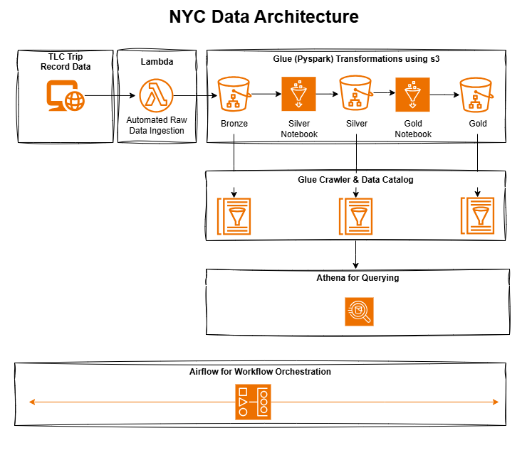
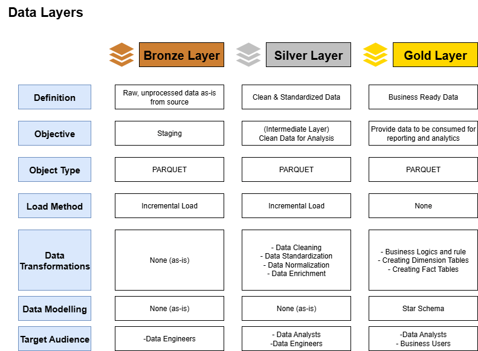

# Index

# Index

1. [NYC Taxi Data Pipeline Overview](#nyc-taxi-data-pipeline-overview)
2. [Problem Statement](#problem-statement)
3. [Approach](#approach)
4. [Architecture](#architecture)
5. [Prerequisites](#prerequisites)
6. [Setup](#setup)
7. [Procedure to Run the Pipeline](#procedure-to-run-the-pipeline)
8. [License](#license)

## NYC Taxi Data Pipeline Overview

This project implements a data pipeline to process NYC Taxi trip data,
delivering actionable insights for urban mobility analytics in a
scalable AWS data lakehouse. An AWS Lambda function initiates the
pipeline by downloading data and triggering an Apache Airflow DAG, which
orchestrates AWS Glue ETL jobs to transform raw data into
analytics-ready datasets.

## Problem Statement

The NYC Taxi and Limousine Commission (TLC) requires a pipeline to
analyze taxi trip data for urban planning and business optimization. Key
objectives include:

-   **Peak Hour Analysis:** Identify high-demand hours using dim_time to
    optimize driver scheduling.
-   **Seasonal Trends:** Analyze trip patterns with dim_date for
    infrastructure planning.
-   **Location Insights:** Use dim_location to identify popular zones
    and airport trips.
-   **Revenue Analysis:** Evaluate fare structures via dim_rate_code for
    pricing strategies.
-   **Payment Behavior:** Study payment preferences and cancellations
    with dim_payment_type.

The pipeline delivers a star schema with fact_trips and dimension
tables, enabling efficient querying in AWS Athena.

## Approach



To address these requirements, we designed a three-layer data lakehouse
pipeline:

-   **Lambda Trigger:** An AWS Lambda function (`lambda_function.py`)
    downloads raw NYC Taxi data (Parquet files) from a public source,
    uploads it to `s3://lakehouse-nyc-taxi/bronze/`, and triggers Airflow DAG.
-   **Bronze Layer:** Store raw data in
    `s3://lakehouse-nyc-taxi/bronze/`, partitioned by year and month.
-   **Silver Layer:** Clean and enrich data in `job_silver.py`, adding
    fields like `pickup_hour` and `trip_duration_minutes`, stored in
    `s3://lakehouse-nyc-taxi/silver/yellow_taxi/`.
-   **Gold Layer:** Transform into a star schema in `job_gold.py`,
    creating dimension tables (`dim_date`, `dim_time`, `dim_location`,
    `dim_rate_code`, `dim_payment_type`) and `fact_trips` (partitioned
    by pickup_date). Features include:
    -   Partition pruning using max_date.
    -   Deduplication in dimensions, preserving IDs.
    -   Parquet upserts for fact_trips using surrogate keys.
-   **Orchestration:** Airflow (`bronze_to_gold_pipeline.py`) manages
    Glue jobs and crawlers.
-   **Cataloging:** Glue Data Catalog stores metadata, updated by
    crawlers.

## Architecture



-   **Bronze Layer:** Raw data in `s3://lakehouse-nyc-taxi/bronze/`,
    partitioned by year and month.
-   **Silver Layer:** Enriched data in
    `s3://lakehouse-nyc-taxi/silver/yellow_taxi/`, partitioned by year
    and month.
-   **Gold Layer:** Star schema in `s3://lakehouse-nyc-taxi/gold/` with
    dimension tables and `fact_trips` (partitioned by pickup_date).
-   **Trigger:** AWS Lambda downloads data and triggers Airflow DAG.
-   **Orchestration:** Airflow coordinates Glue ETL jobs.
-   **ETL:** Glue jobs (`job_silver.py`, `job_gold.py`) handle
    transformations.
-   **Catalog:** Glue Data Catalog enables Athena querying in
    `nyc_taxi_db`.

## Prerequisites

-   **AWS Account:** Access to S3, Glue, Lambda, and Airflow (e.g.,
    MWAA).
-   **IAM Role:** `GlueNYCTaxiRole` with S3, Glue, Lambda, and
    CloudWatch permissions.
-   **S3 Bucket:** `lakehouse-nyc-taxi` for data;
-   **Airflow:** `aws_default` connection in `us-east-1`.
-   **Python:** 3.x for Glue and Lambda.
-   **Dependencies:** PySpark, boto3 (Glue 5.0),
    apache-airflow-providers-postgres,
    apache-airflow-providers-amazon==7.2.0.
-   **Docker:** For local Airflow setup using Dockerfile and
    docker-compose.yml.

## Setup

### S3 Configuration:

-   Create `s3://lakehouse-nyc-taxi/` with subfolders: `bronze/`,
    `silver/yellow_taxi/`, `gold/`.
-   Upload `job_silver.py` and `job_gold.py` s3.

### Glue Configuration:

-   Create Glue jobs: `job_silver` and `job_gold` (Glue 5.0, Python 3,
    WorkerType G.1X, 2 workers).
-   Set IAM role.
-   Create crawlers: `NYCTaxiBronzeCrawler`, `NYCTaxiSilverCrawler`,
    `NYCTaxiGoldCrawler`.

### Lambda Configuration:

-   Create a Lambda function with `lambda_function.py`.
-   Set environment variables: `AIRFLOW_USERNAME` and
    `AIRFLOW_PASSWORD`.
-   Configure IAM role with S3 write and Airflow API invoke permissions.

## Procedure to Run the Pipeline

1.  **Build Docker Image:**

    ``` bash
    docker build -t airflow-custom .
    ```

2.  **Start Airflow:**

    ``` bash
    docker-compose up -d
    ```

3.  **Access Airflow UI:** http://localhost:8080.

4.  **Upload DAG:**

    -   Place `bronze_to_gold_pipeline.py` in `./dags/`.

5.  **Deploy Lambda:**

    -   Upload `lambda_function.py` to AWS Lambda.
    -   Configure trigger (e.g., manual, EventBridge schedule, or S3
        event).

6.  **Run Pipeline:**

    -   Invoke Lambda function to download data (e.g.,
        `yellow_tripdata_2019-01.parquet`), upload to
        `s3://lakehouse-nyc-taxi/bronze/year=YYYY/month=MM/`, and
        trigger Airflow DAG with:

        ``` json
        {"year": "2019", "month": "01"}
        ```

7.  **Monitor Execution:**

    -   Check Lambda logs, Airflow UI, and AWS Console for Glue
        jobs/crawlers.

8.  **Query Results:**

    -   Use Athena to query `nyc_taxi_db.fact_trips` and dimension
        tables.

## License

MIT License. See LICENSE for details.
